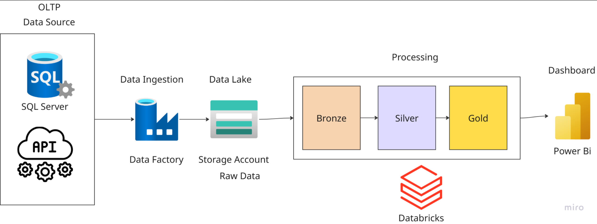

# 🧠 Azure Databricks Power BI Analytics Pipeline  

---

## 📚 Table of Contents
- [Overview](#-overview)
- [Key Features](#-key-features)
- [Architecture](#-architecture)
- [Technologies & Tools](#-technologies--tools)
- [Pipeline Flow](#-pipeline-flow)
- [Prerequisites](#-prerequisites)
- [Setup & Deployment](#-setup--deployment)
- [Key Metrics & KPIs](#-key-metrics--kpis)
- [Dashboard](#-dashboard)
- [Authors](#-authors)
- [Acknowledgments](#-acknowledgments)
- [License](#-license)

---

## 📋 Overview

This project demonstrates a **production-grade data engineering and analytics solution** built entirely on **Microsoft Azure**.  
It implements a scalable, secure, and automated **data pipeline** that ingests product sales data from multiple sources, processes it through the **Medallion Architecture**, and delivers actionable insights via **Power BI dashboards**.

**Developed by:** Abdalla Elmougi & Karim Khaled  

---

## 🚀 Key Features

- 🔗 **Multi-source integration** from SQL Server & REST APIs  
- ⚙️ **Automated ETL workflows** using Azure Data Factory  
- 🧮 **Scalable data processing** with Azure Databricks (PySpark)  
- 🏗️ **Medallion Architecture (Bronze → Silver → Gold)** for governance & data quality  
- 📊 **Interactive Power BI dashboards** with real-time insights  

---

## 🏗️ Architecture

The solution follows the **Medallion Architecture**, ensuring modularity, scalability, and traceability.

🔹 Click to expand Architecture Details

### Architecture Components

#### 1. 🗄️ Data Sources
- **SQL Server** – Stores historical sales and product transactions  
- **REST APIs** – Provides real-time product and supplementary data  

#### 2. 🔄 Data Ingestion (Azure Data Factory)
- Orchestrates data extraction from multiple sources  
- Supports **incremental** and **full-load** patterns  
- Schedules and monitors pipelines  
- Loads raw data into **Azure Data Lake**  

#### 3. 💾 Data Lake (Azure Storage Account)
| Layer | Description |
|--------|--------------|
| **Bronze** | Raw, unprocessed data in original format |
| **Silver** | Cleaned, validated, and standardized data |
| **Gold** | Aggregated, business-ready datasets optimized for analytics |

#### 4. ⚙️ Data Processing (Azure Databricks)
- Distributed processing using **PySpark**  
- Data quality validation & transformation logic  
- Delta Lake format for ACID compliance and fast queries  

#### 5. 📊 Data Visualization (Power BI)
- Connects directly to **Gold Layer**  
- Interactive dashboards with KPIs, filters, and drill-downs  
- Scheduled refresh and Power BI Service deployment  

---

## 🛠️ Technologies & Tools

| Category | Technology | Purpose |
|----------|-------------|----------|
| **Cloud Platform** | Microsoft Azure | Infrastructure & Services |
| **Database** | Azure SQL Server | Transactional Data Source |
| **API Integration** | REST API | External Real-time Data |
| **Orchestration** | Azure Data Factory | ETL Workflow Automation |
| **Storage** | Azure Data Lake Gen2 | Scalable Data Storage |
| **Processing** | Azure Databricks | Big Data Computation |
| **Languages** | PySpark, Python, SQL | Data Transformation |
| **Visualization** | Power BI | Business Intelligence |
| **Data Format** | Delta Lake, Parquet | Optimized Data Storage |

---

## 🔁 Pipeline Flow

🧩 Click to expand Step-by-Step Process

### 1. Data Extraction
- ADF retrieves data from SQL Server & APIs  
- Manages authentication & connections securely  
- Writes data to the **Bronze layer**  

### 2. Bronze Layer – Raw Data
- Stores original data with timestamps & metadata  
- Preserves complete lineage for auditing  

### 3. Silver Layer – Cleansed Data
- Deduplication, null handling, and data validation  
- Data type standardization and conformed dimensions  

### 4. Gold Layer – Business Data
- Aggregations and business transformations  
- Star schema design for optimized analytics  

### 5. Power BI Dashboards
- Connects to Gold Layer tables  
- Visualizes KPIs (sales, products, customers)  
- Published to Power BI Service  

---

## 🧩 Prerequisites

- Azure subscription with required permissions  
- Azure SQL Server instance  
- Azure Data Lake Storage Gen2 account  
- Azure Databricks workspace  
- Power BI Desktop & Service accounts  
- Basic knowledge of **Python**, **PySpark**, and **SQL**

---

## ⚙️ Setup & Deployment

🧱 Click to expand Setup Instructions

### 1. Configure Azure Data Factory
- Create linked services for SQL Server & Data Lake  
- Import pipeline definitions from `/adf/pipelines`  
- Configure triggers and validation checks  

### 2. Set Up Databricks
- Import notebooks from `/databricks` folder  
- Configure cluster runtime & compute settings  
- Mount Azure Data Lake via **secret scopes**  
- Execute transformation notebooks  

### 3. Deploy Power BI Reports
- Open `.pbix` files from `/powerbi/reports`  
- Update data source paths  
- Publish to **Power BI Service workspace**  
- Configure **Row-Level Security (RLS)** if needed  

---

## 📊 Key Metrics & KPIs

Power BI dashboards provide real-time analytics for:

- 💰 **Sales Performance:** Revenue trends, growth rates, and top products  
- 📦 **Product Analytics:** Category insights and stock movement  
- 👥 **Customer Behavior:** Purchase patterns and segmentation  
- ⚙️ **Operational Efficiency:** Pipeline success rate and data freshness  

---

## 📈 Data Visualization 

---

## 👨‍💻 Authors

- **Abdalla Elmougi**  
- **Karim Khaled** – [@karim31003](https://github.com/karim31003)

---

## 🙏 Acknowledgments

Special thanks to **[Eng. Mohammed Hameds](https://github.com/MohammedHameds)** for his continuous guidance and mentorship throughout this project.

---

## 📄 License

This project is licensed under the **MIT License** 
